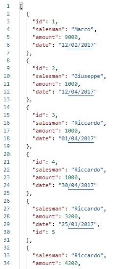
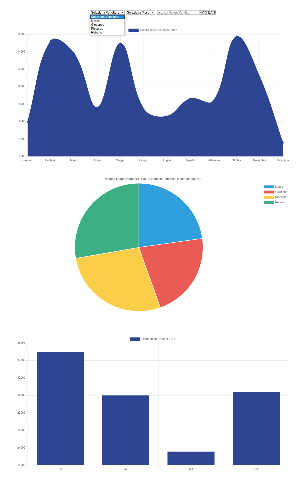

# Rest-chartbool
Dashboard of data taken from an API. Made with ChartJS.  

* The 1° chart is a line chart that shows the sales of the company month by month.
* The 2° chart is a graph chart that shows how much a salesman has contributed (in percentage) to the yearly revenue.
* The 3° chart is a bar chart that shows the sales of the company per quarter.  

It is possible to add a sale by selecting the salesman, the month and the amount. (post).  
(Warning: the api doesn't work anymore)  

Handlebars has been used to add the names of the salesman to the 'select salesman list'.   

HTML, CSS, JavaScript, jQuery, Handlebars.
***
### [Live Website](https://gianluigivitale.github.io/rest-chartbool/)
***
### Preview-api:

### Preview:

